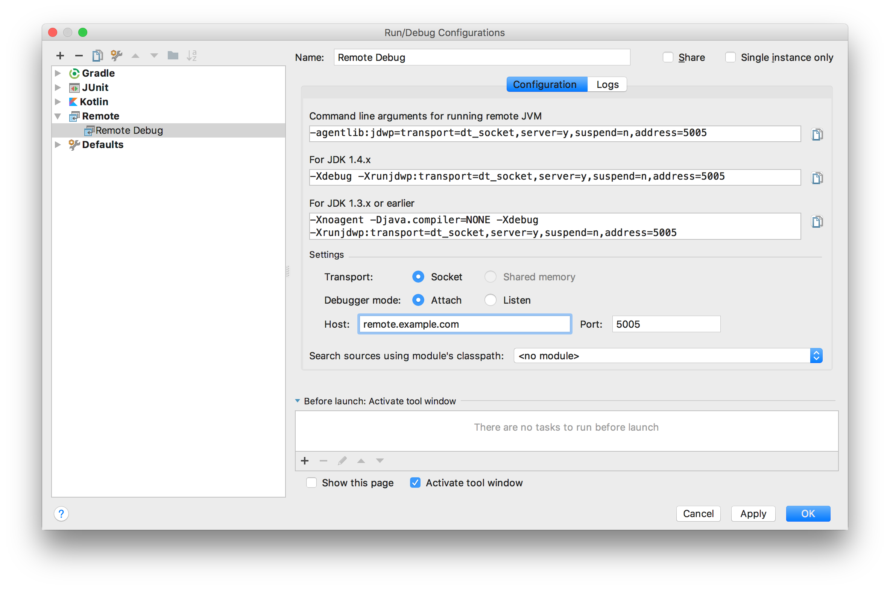

# Create TCP Tunnel/Port Forwarding by SSH

Let's assume that you're going to expose your service to outside of the world. Let's say:

1. You have a server `example.com` which can be access from the Internet
2. You have two servers 192.168.0.100 and 192.168.0.101 at home.
3. Your internal service is running under http://192.168.0.101:10080
4. You want guests can access your service by http://example.com:8080

### Remote Port Forwarding

```bash
# -N: Do not execute a remote command. This is useful for just forwarding ports
# -R: Specifies that the given port on the remote (server) host is to be forwarded to the given host and port on the local side.
ssh -N -R 8080:example.com:10080 <username>@example.com
```



### References

[https://linux.die.net/man/1/ssh](https://linux.die.net/man/1/ssh)

