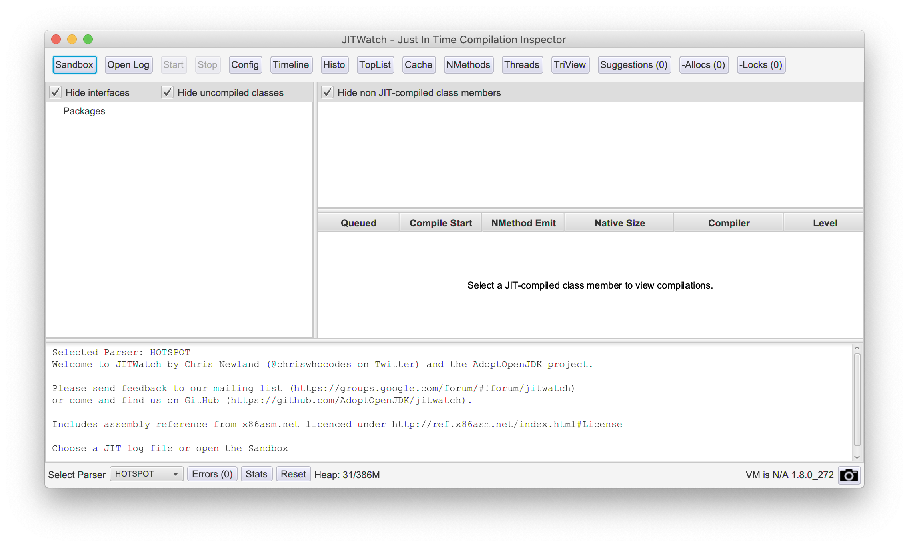

# 如何安装 JITWatch

JITWatch 是一款用于分析和可视化 HotSpot JIT Compiler 的工具。JITWatch 是基于 JavaFX 开发的。而 2020 年的现在，可能很多人已经不选择 Oracle JDK 作为默认的 JDK 版本，而其他版本的 JDK 可能没有自带 JavaFX 包，安装和使用 JITWatch 会稍显麻烦。

## TL;DR

```bash
# 获取源代码
git clone https://github.com/AdoptOpenJDK/jitwatch.git

# 构建
cd gitwatch
mvn clean install -DskipTests=true

# 启动 JITWatch 如果你使用的是自带了 JavaFX 的 JDK 版本，例如 Oracle JDK。
# ./launchUI.sh

# 下载对应的 OpenJFX 
wget https://chriswhocodes.com/downloads/openjfx-8u60-sdk-overlay-osx-x64.zip

# 设置 CLASSPATH
export CLASSPATH=/path/to/openjfx-8u60-sdk-overlay-osx-x64/jre/lib/ext/jfxrt.jar

# 启动 JITWatch
./launchUI.sh
```



### 下载并构建 JITWatch

git clone  JITWatch 到本地（[https://github.com/AdoptOpenJDK/jitwatch](https://github.com/AdoptOpenJDK/jitwatch)）, 然后执行 mvn/gradle  的构建命令。

```bash
git clone https://github.com/AdoptOpenJDK/jitwatch.git

mvn clean install -DskipTests=true

# Or

gradlew clean build run
```

### 下载 JavaFX 并配置 CLASSPATH

由于 JITWatch 使用 JavaFX 构建其用户界面，如果你使用的 JDK 没有自带 JavaFX 包，你有两个选择：

1、下载 Oracle JDK  
[https://www.oracle.com/java/technologies/javase-downloads.html](https://www.oracle.com/java/technologies/javase-downloads.html)

2、单独下载 JavaFX  
你可以到 [https://chriswhocodes.com/](https://chriswhocodes.com/) 这里下载对应的 OpenJFX  包。下载后解压，并设置 CLASSPATH。

```text
# 通过环境变量设置 CLASSPATH 
export CLASSPATH=/path/to/openjfx-8u60-sdk-overlay-osx-x64/jre/lib/ext/jfxrt.jar
```

又或者你可以通过 -cp 参数指定 CLASSPATH 路径。

打开并修改 launchUI.sh

```bash
...
CLASSPATH=$CLASSPATH:core/build/classes/java/main
CLASSPATH=$CLASSPATH:ui/build/classes/java/main
CLASSPATH=$CLASSPATH:ui/src/main/resources

# 添加 JavaFX 到 CLASSPATH
CLASSPATH=$CLASSPATH:/path/to/openjfx-8u60-sdk-overlay-osx-x64/jre/lib/ext/jfxrt.jar

"$JAVA_HOME/bin/java" -Djava.library.path=$JAVA_HOME/lib/amd64 -cp "$CLASSPATH" "$@" org.adoptopenjdk.jitwatch.launch.LaunchUI
```

### 启动 JITWatch

```text
./launchUI.sh
```

