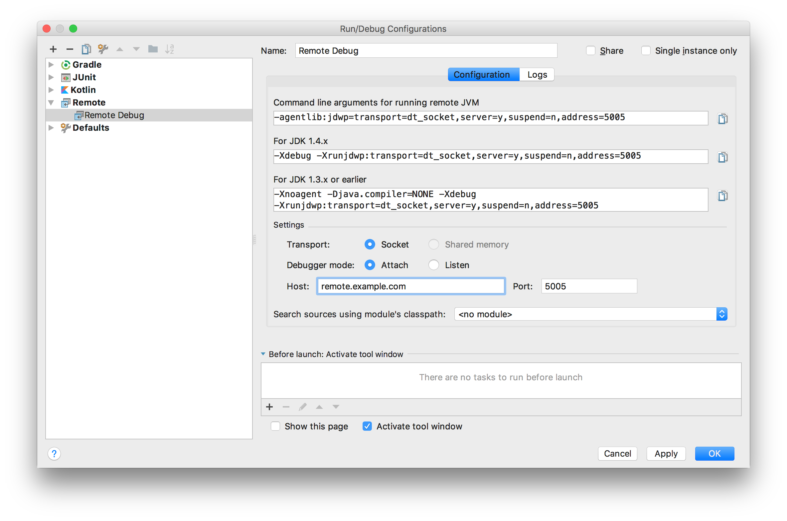

# 使用 OWASP ZAP 扫描网页/API漏洞

OWASP ZAP 是一款开源、免费和跨平台的网站/API安全漏洞扫描工具。

提供了基于 GUI 和 Command Line \(Headless\) 两种使用方式。可以很容易地集成到 CI/ID 流程中，轻松地在每一次 commit 都进行安全漏洞检测。

ZAP 启动时，会在本地开启一个 HTTP 代理。所有流经代理的流量都会被 ZAP 记录下来，然后进行安全性分析。 在 GUI 模式下，你可以通过 ZAP 调用浏览器，然后访问你要测试的网站。如下图所示，ZAP 会实时监测网站漏洞。同时 ZAP 会把控制面板注入到你要测试的网页当中，你可以直接在网页中启动攻击或者爬虫。




你也可以用命令行的方式使用 ZAP。首先你需要设置环境变量`http_proxy`和`https_proxy`来配置代理。然后再访问你需要测试的API。例如下面的 curl 命令发出的请求会被 ZAP 捕获，然后显示在 GUI 上。

```bash
# Set HTTP proxy
export http_proxy=localhost:8080
export https_proxy=localhost:8080

# Access the API that you gonna test
curl -k https://imlc.me
```

