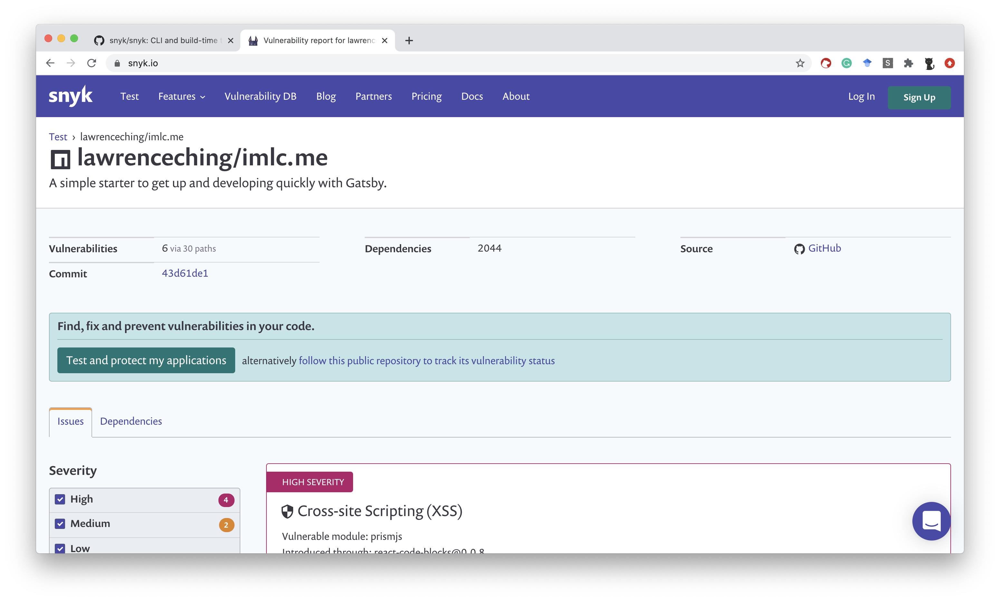
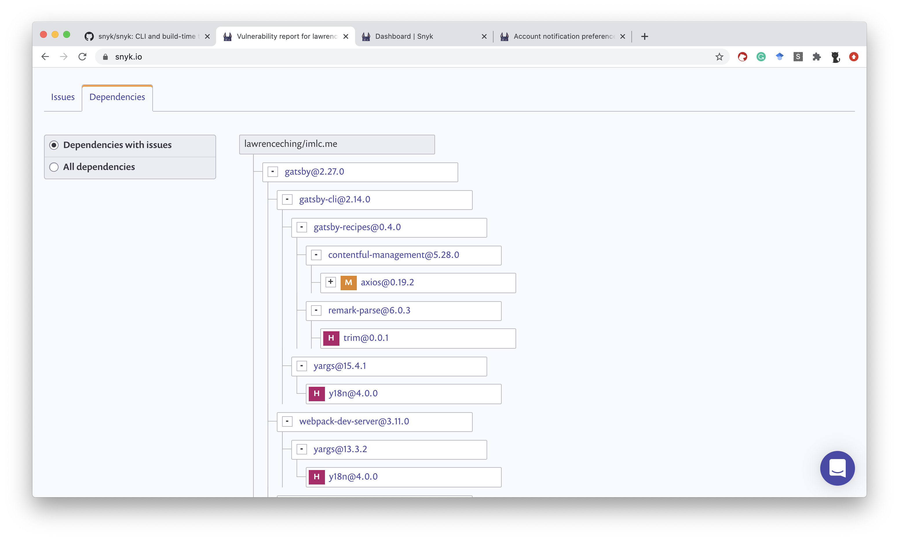
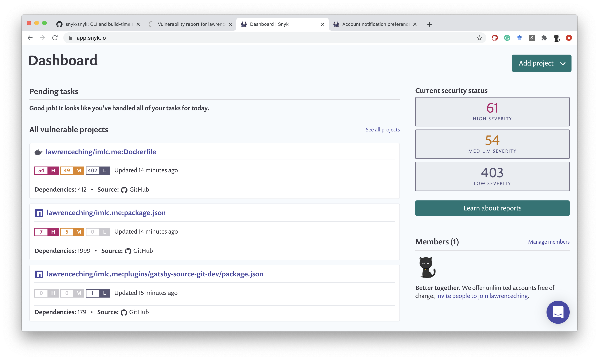

# 借助 snyk 免费扫描项目漏洞

snyk 可以帮助开发者发现、修复和监控项目漏洞。除了付费服务，snyk 还提供 100次容器漏洞扫描、容器镜像修复、CLI 本地扫描等免费服务。对个人项目来说应该是足够了。

snyk 提供了两种扫描方式——在线扫描和离线 CLI 扫描。

在线扫描可以指定 GitHub、GitLab、BitBucket 等在线 Git 仓库，也可以指定 Docker Hub、GCR 等容器进行服务。离线扫描支持 Kubernetes、CLI、Jenkins、IDE 插件等多种方式。总而言之，在开发周期内的各个阶段，snyk 都提供了支持。

如果你使用在线扫描，扫描后的结果直接以网页的形式展现。如下图所示：

